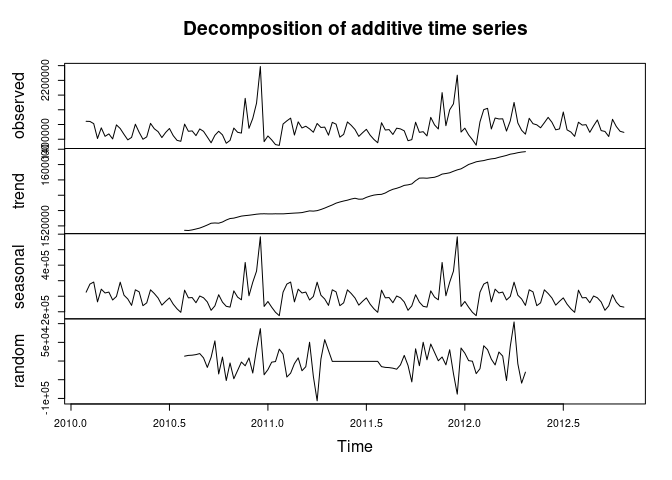

## Leitura dos Dados

    data <- read.csv("C:/Users/moaba/OneDrive/Documentos/forecast-r/walmart-sales-dataset-of-45stores.csv")

    names(data)

    ## [1] "Store"        "Date"         "Weekly_Sales" "Holiday_Flag" "Temperature" 
    ## [6] "Fuel_Price"   "CPI"          "Unemployment"

    head(data)

    ##   Store       Date Weekly_Sales Holiday_Flag Temperature Fuel_Price      CPI
    ## 1     1 05-02-2010      1643691            0       42.31      2.572 211.0964
    ## 2     1 12-02-2010      1641957            1       38.51      2.548 211.2422
    ## 3     1 19-02-2010      1611968            0       39.93      2.514 211.2891
    ## 4     1 26-02-2010      1409728            0       46.63      2.561 211.3196
    ## 5     1 05-03-2010      1554807            0       46.50      2.625 211.3501
    ## 6     1 12-03-2010      1439542            0       57.79      2.667 211.3806
    ##   Unemployment
    ## 1        8.106
    ## 2        8.106
    ## 3        8.106
    ## 4        8.106
    ## 5        8.106
    ## 6        8.106

## Preparando os dados

You can also embed plots, for example:

    lojas <- data %>%
      select(Store, Weekly_Sales, Date) %>%
      rename(store = Store, weekly_sales = Weekly_Sales, date = Date) %>%
      group_by(store)

## Criando a série temporal

    ts_loja <- lojas %>%
      filter(store == 1) %>%
      ungroup() %>%
      select(weekly_sales) %>%
      ts(frequency = 52, start = c(2010,5), end = c(2012,43))

    autoplot(ts_loja) +
      ggtitle("Walmart: vendas da loja 1") +
      xlab("Ano") +
      ylab("Vendas")

### Sazonalidade

    ggseasonplot(ts_loja) +
      ggtitle("Sazonalidade das vendas") +
      xlab("Semana") + 
      ylab("Vendas")

## Forecast

    autoplot(forecast(ts_loja))

### Usando o modelo de regressão linear

    fit_loja1 <- tslm(ts_loja ~ season + trend)
    fc_linear <- forecast(fit_loja1, h = 104)
    autoplot(fc_linear)

