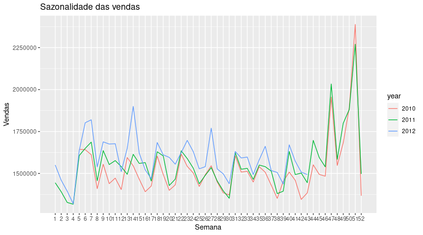

## Leitura dos Dados

```         
data <- read_csv("https://raw.githubusercontent.com/moabalv/analise-dados/main/walmart-sales-dataset-of-45stores.csv")

## Rows: 6435 Columns: 8
## ── Column specification ────────────────────────────────────────────────────────
## Delimiter: ","
## chr (1): Date
## dbl (7): Store, Weekly_Sales, Holiday_Flag, Temperature, Fuel_Price, CPI, Un...
## 
## ℹ Use `spec()` to retrieve the full column specification for this data.
## ℹ Specify the column types or set `show_col_types = FALSE` to quiet this message.

names(data)

## [1] "Store"        "Date"         "Weekly_Sales" "Holiday_Flag" "Temperature" 
## [6] "Fuel_Price"   "CPI"          "Unemployment"
```

## Preparando os dados

Os dados têm informações das vendas semanais de 45 lojas do walmart ao
longo de 143 semanas.

```         
lojas <- data %>%
  select(Store, Weekly_Sales, Date) %>%
  rename(store = Store, weekly_sales = Weekly_Sales, date = Date) %>%
  mutate(date = as.POSIXct(date, format = "%d-%m-%Y"))
```

## Criando a série temporal

Os dados estão organizados semanalmente, a partir da 5ª semana de 2010
até a 43ª semana de 2012. Segue o gráfico com a série temporal das
vendas da loja 1.

```         
loja_1 <- lojas %>%
  filter(store == 1) %>%
  select(date, weekly_sales)

ts_loja <- loja_1 %>%
  select(weekly_sales) %>%
  ts(frequency = 52, start = c(2010,5), end = c(2012,43))

ggplot(ts_loja) +
  geom_line(mapping = aes(y = ts_loja[], x = loja_1$date)) +
  scale_x_datetime(name = "Ano e mês", date_labels = "%Y-%m", date_breaks = "3 month") + 
  scale_y_continuous(name = "Vendas") +
  theme_bw()
```


### Sazonalidade

Observa-se que a tendência é que o número de vendas suba com o passar
dos anos.Já em relação a sazonalidade as compras sempre têm picos nos
meses de dezembro e novembro e uma forte queda no fim do ano.

```         
ggseasonplot(ts_loja) +
  ggtitle("Sazonalidade das vendas") +
  xlab("Semana") + 
  ylab("Vendas")
```



```         
plot(decompose(ts_loja))
```


## Forecast

Para o forecast, foi separado cerca de 80% dos dados (115 observações)
para o treinamento dos modelos. Enquanto os outros 20% dos dados (28
observações) foram reservados para os testes.

```         
ts_loja.train = window(ts_loja, end = time(ts_loja)[115])
ts_loja.test = window(ts_loja, start= time(ts_loja)[116])
```

Primeiramente, foi realizado o forecast utilizando a série temporal,
neste caso a função forecast fez uso de um modelo ETS.

```         
fc <- forecast(ts_loja.train, h = 28)


accuracy(fc, ts_loja.test)

##                      ME     RMSE      MAE        MPE     MAPE      MASE
## Training set   6674.142 36873.69 26785.35  0.3834622 1.684811 0.3899432
## Test set     -22213.335 55701.97 44376.18 -1.4843041 2.818353 0.6460317
##                     ACF1 Theil's U
## Training set -0.04134792        NA
## Test set     -0.20091553 0.4805977

autoplot(fc, include = 10) +
  autolayer(ts_loja.test, series = "Observado")
```


Observa-se que em alguns pontos, o valor observado chega a ficar de fora
do intervalo de predição. Aqui o valor do RMSE foi de 55701.

## Usando o modelo de regressão linear

Posteriormente, foi utilizado um modelo de regressão linear, utilizando
a sazonlidade e a tendência da série como regressores.:

```         
fit_loja1 <- tslm(ts_loja.train ~ season + trend)
fc_linear <- forecast(fit_loja1, h = 28)
accuracy(fc_linear, ts_loja.test)

##                         ME     RMSE      MAE         MPE     MAPE      MASE
## Training set -6.074407e-12 36643.19 28304.06 -0.05000451 1.796425 0.4120526
## Test set     -1.086395e+04 51547.82 40558.11 -0.76656995 2.564815 0.5904480
##                    ACF1 Theil's U
## Training set  0.1184813        NA
## Test set     -0.2234191 0.4517022
```

Nesse caso os valores de erro obtidos são menores que o do modelo
anterior, sendo o RMSE aqui de 51547.

Ao comparar os valores previstos pelo modelo com os valores observados,
temos que:

```         
autoplot(fc_linear, include = 10, series = "Previsto") +
  autolayer(ts_loja.test, series = "Observado") +
  labs(y = "Vendas", x = "Ano") +
  scale_color_manual(values = c("Observado" = "red"))
```


```         
checkresiduals(fit_loja1)
```


```         
## 
##  Breusch-Godfrey test for serial correlation of order up to 56
## 
## data:  Residuals from Linear regression model
## LM test = 104.38, df = 56, p-value = 9.384e-05
```
