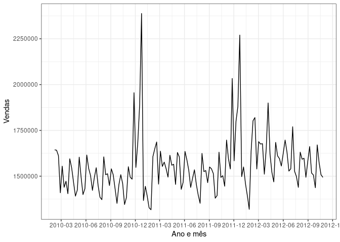

## Leitura dos Dados

    data <- read.csv("https://raw.githubusercontent.com/moabalv/analise-dados/main/walmart-sales-dataset-of-45stores.csv")

    names(data)

    ## [1] "Store"        "Date"         "Weekly_Sales" "Holiday_Flag" "Temperature" 
    ## [6] "Fuel_Price"   "CPI"          "Unemployment"

## Preparando os dados

Os dados têm informações das vendas semanais de 45 lojas do walmart ao
longo de 143 semanas.

    lojas <- data %>%
      select(Store, Weekly_Sales, Date) %>%
      rename(store = Store, weekly_sales = Weekly_Sales, date = Date) %>%
      group_by(store)

## Criando a série temporal

Os dados estão organizados semanalmente, a partir da 5ª semana de 2010
até a 43ª semana de 2012. Segue o gráfico com a série temporal das
vendas da loja 1.

    ts_loja <- lojas %>%
      filter(store == 1) %>%
      ungroup() %>%
      select(weekly_sales) %>%
      ts(frequency = 52, start = c(2010,5), end = c(2012,43))

    autoplot(ts_loja) +
      ggtitle("Walmart: vendas da loja 1") +
      xlab("Ano") +
      ylab("Vendas")

### Sazonalidade

Observa-se que a tendência é que o número de vendas suba com o passar
dos anos.Já em relação a sazonalidade as compras sempre têm picos nos
meses de dezembro e novembro e uma forte queda no fim do ano.

    ggseasonplot(ts_loja) +
      ggtitle("Sazonalidade das vendas") +
      xlab("Semana") + 
      ylab("Vendas")

## Forecast

    autoplot(forecast(ts_loja))

### Usando o modelo de regressão linear

Passando a sazonalidade dos dados e a tendência como regressores obtemos
a seguinte predição:

    fit_loja1 <- tslm(ts_loja ~ season + trend)
    fc_linear <- forecast(fit_loja1, h = 104)
    autoplot(fc_linear)

Enquanto se desconsiderarmos esses fatores, teríamos que:

    fit_loja1 <- tslm(ts_loja ~ season)
    fc_linear <- forecast(fit_loja1, h = 104)
    autoplot(fc_linear) +
      ggtitle("Predição apenas com a sazonalidade dos dados")

    fit_loja1 <- tslm(ts_loja ~ trend)
    fc_linear <- forecast(fit_loja1, h = 104)
    autoplot(fc_linear) + 
      ggtitle("Predição apenas com a tendência dos dados")

Em ambos os casos o intervalo de predição tem um aumento.
